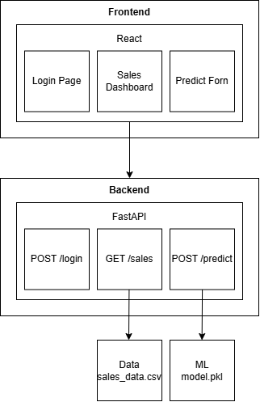
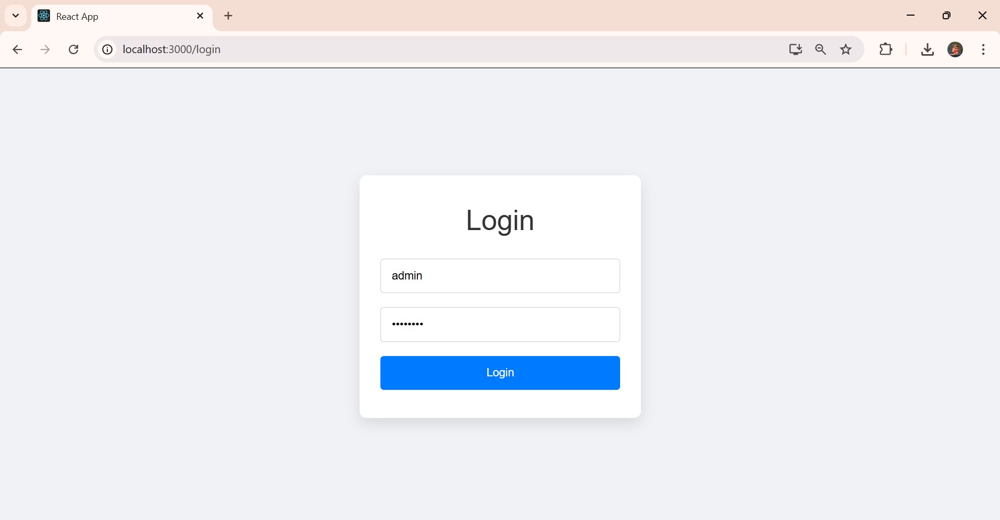
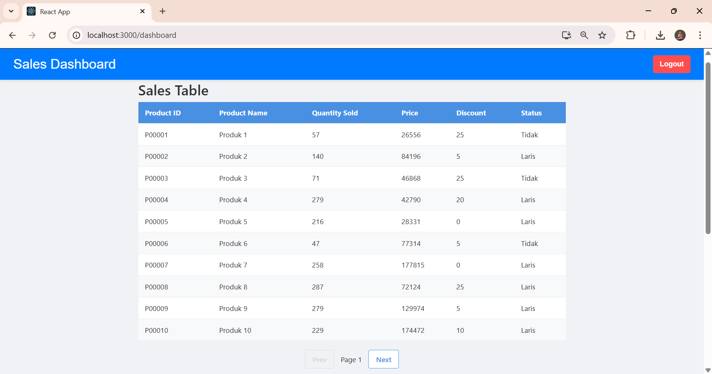
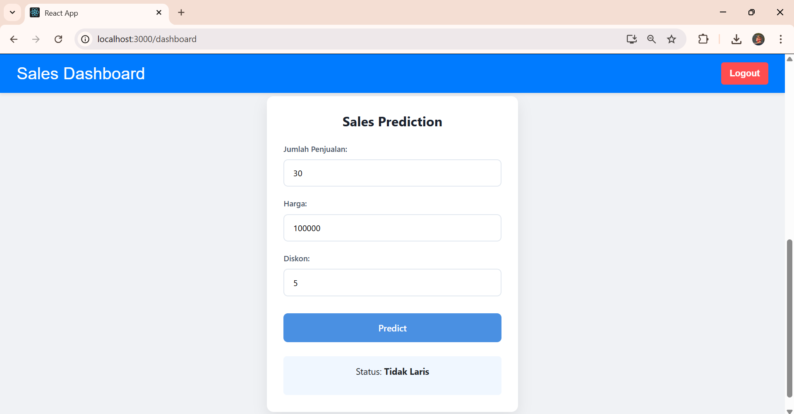
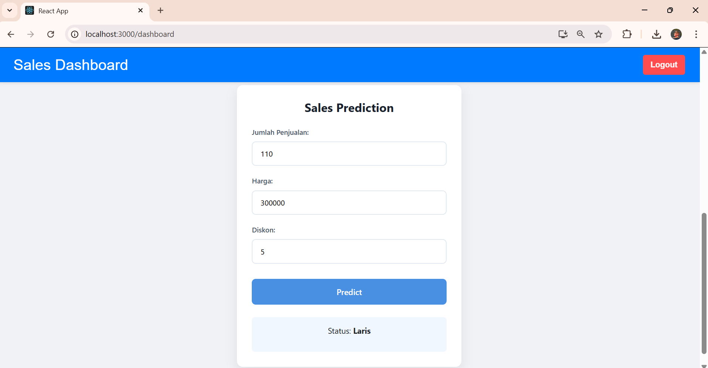

# Mini AI Sales Prediction System

Sistem prediksi status produk (Laris / Tidak Laris) berbasis Machine Learning dengan dashboard penjualan produk.

## System Design



## Alur Data

1. Autentikasi/Login
   User Input Credential → POST /login → JWT Token → localStorage
2. Sales Dashboard
   Dashboard Load  → GET /sales → Bckend membaca sales_data.csv → JSON → Tabel Sales
3. Prediksi Produk
   User input form → → POST /predict → Backend load model.pkl → model memprediksi → Return hasil prediksi "Laris"/"Tidak" → Tampilkan hasil prediksi di UI

## Cara Menjalankan Project

 
### 1. Clone & Setup
 
```bash
git clone https://github.com/janiceiv/mini-ai-sales-prediction-system
cd ai-sales-prediction
```
 
### 2. Jalankan Backend
 
```bash
cd backend
python -m venv venv
 
# Windows
venv\Scripts\activate
# Mac/Linux
source venv/bin/activate
 
pip install -r requirements.txt
uvicorn main:app --reload --port 8000
```
 
Backend berjalan di → `http://localhost:8000`
API Docs (Swagger) → `http://localhost:8000/docs`
 
### 3. Jalankan Frontend
 
```bash
cd frontend
npm install
npm start
```
 
Frontend berjalan di → `http://localhost:3000`

## Design Decision

1. Logistic Regression digunakan untuk melatih model ML karena dataset relatif kecil dan cukup untuk binary classification sederhana. Model disimpan agar tidak perlu retrain setiap kali load.
2. JWT token disimpan di client.
3. Struktur folder modular dan setiap endpoint dipisah filenya agar mudah maintain.

## Assumptions

1. Dummy user untuk autentikasi username: admin, password: admin123.
2. Data source menggunakan file CSV yang telah disediakan, dapat langsung load tidak memerlukan database.
3. Frontend dan backend berjalan di localhost.
4. Prediksi dengan model sederhana, tidak harus 100% akurat.
   

## Screenshot UI




